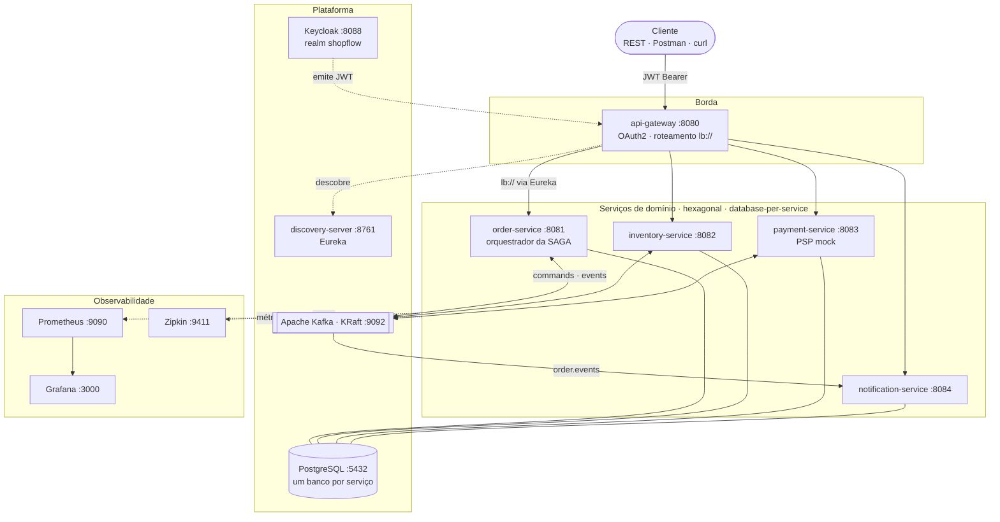
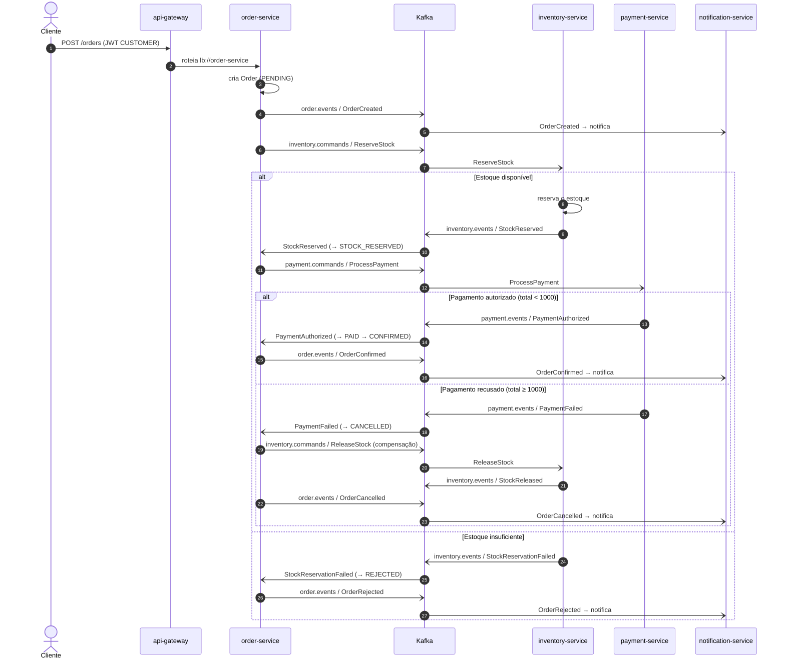

# 🛒 ShopFlow

> Backend de **e-commerce orientado a eventos**: pedidos processados por uma **SAGA orquestrada** sobre
> **Apache Kafka**, em uma arquitetura de microsserviços com **Spring Boot / Spring Cloud**, observabilidade,
> segurança e CI/CD.

[](https://github.com/wastecoder/shopflow/actions/workflows/ci.yml)
[](https://github.com/wastecoder/shopflow/actions/workflows/publish-images.yml)


Projeto **backend-only** de aprendizado/portfólio para praticar Kafka, Spring Cloud, Docker e CI/CD. Não há
front-end: os clientes são **simulados** via REST (Postman/`curl`/testes). O escopo atual é o **MVP + Notification**.

---

## 📑 Sumário

- [Visão geral](#-visão-geral)
- [Arquitetura](#-arquitetura)
- [Fluxo da SAGA](#-fluxo-da-saga)
- [Stack](#-stack)
- [Como rodar](#-como-rodar)
- [O fluxo na prática](#-o-fluxo-na-prática)
- [Observabilidade](#-observabilidade)
- [Segurança](#-segurança)
- [Testes e qualidade](#-testes-e-qualidade)
- [Estrutura do repositório](#-estrutura-do-repositório)
- [Documentação](#-documentação)
- [Roadmap](#-roadmap)

---

## 🎯 Visão geral

Um pedido (`POST /orders`) dispara uma **SAGA orquestrada** pelo `order-service`: reservar estoque →
autorizar pagamento → confirmar — com **compensação** automática (liberar estoque) quando o pagamento falha.
A comunicação entre serviços é **100% assíncrona** via Kafka (comandos e eventos), com consumidores
**idempotentes** e **Dead Letter Topics** por consumidor.

Objetivos de aprendizado exercitados aqui:

- **Mensageria & SAGA** — Spring Kafka (KRaft), produtor idempotente, ordenação por `orderId`, DLT.
- **Microsserviços** — API Gateway, service discovery (Eureka), arquitetura **hexagonal** e
  **database-per-service**.
- **Qualidade** — testes de integração com **Testcontainers**, gates de **JaCoCo + Pitest**, OpenAPI/Swagger.
- **Observabilidade** — métricas (Prometheus/Grafana) e tracing distribuído (Zipkin), inclusive **pelo Kafka**.
- **Segurança** — OAuth2/JWT com Keycloak (gateway + resource servers).
- **CI/CD** — GitHub Actions (build + testes) e publicação de imagens no GHCR.

A visão de longo prazo (pós-MVP) está em [`doc/FUTURE-PROGRESS.md`](doc/FUTURE-PROGRESS.md).

---

## 🏗 Arquitetura

Arquitetura hexagonal (ports & adapters) por serviço; dependências apontam para dentro
(`adapter → application → domain`). Cada serviço tem seu próprio schema no PostgreSQL
(*database-per-service*) e se comunica com os demais apenas por Kafka.



Detalhes (componentes, ADRs e contratos de evento) em [`doc/CHALLENGE.md`](doc/CHALLENGE.md) (§4, §8, §11).

---

## 🔄 Fluxo da SAGA

O `order-service` é o **orquestrador**: emite comandos e reage às respostas, avançando ou **compensando** a
saga. Estados do pedido: `PENDING → STOCK_RESERVED → PAID → CONFIRMED` (e os terminais `REJECTED` / `CANCELLED`).



**Tópicos Kafka:** `inventory.commands`, `payment.commands`, `order.events`, `inventory.events`,
`payment.events` (+ um `<topic>.DLT` por consumidor). Envelope JSON: `{ eventId, type, orderId, occurredAt, payload }`,
chave de partição = `orderId` (ordenação por pedido). Detalhes do fluxo em [`doc/CHALLENGE.md`](doc/CHALLENGE.md) (§6).

---

## 🧰 Stack

| Camada | Tecnologia |
|---|---|
| Linguagem / build | **Java 21**, **Gradle 9.5.1** (Kotlin DSL), monorepo multi-projeto |
| Framework | **Spring Boot 4.0.7**, **Spring Cloud 2025.1.1** ("Oakwood") |
| Mensageria | **Apache Kafka** (KRaft) + **Spring Kafka** (produtor idempotente, DLT) |
| Persistência | **PostgreSQL** (database-per-service), **Flyway**, **MapStruct 1.6.3** |
| Discovery / Gateway | **Eureka** + **Spring Cloud Gateway** (roteamento `lb://`) |
| Observabilidade | **Micrometer → Prometheus → Grafana**; **tracing → Zipkin** (Brave) |
| Segurança | **Keycloak** (OAuth2 / JWT), gateway + resource servers |
| Testes / qualidade | **Testcontainers**, **JUnit 5**, **JaCoCo**, **Pitest**, **springdoc/OpenAPI 3.0.3** |
| CI/CD | **GitHub Actions** (build + testes) + publicação de imagens no **GHCR** |

Stack completa e decisões em [`doc/CHALLENGE.md`](doc/CHALLENGE.md) (§10, §11).

---

## 🚀 Como rodar

**Pré-requisitos:** Docker (+ Docker Compose) e JDK 21. No Windows, use `gradlew.bat` no lugar de `./gradlew`.

```bash
# 1) Sobe a infraestrutura (Kafka, PostgreSQL, Keycloak, Prometheus, Grafana, Zipkin, Kafka UI)
docker compose up -d

# 2) Sobe os serviços (em terminais separados; o discovery primeiro)
./gradlew :discovery-server:bootRun
./gradlew :order-service:bootRun
./gradlew :inventory-service:bootRun     # popula 4 produtos de exemplo (profile "seed", ativo no dev)
./gradlew :payment-service:bootRun
./gradlew :notification-service:bootRun
./gradlew :api-gateway:bootRun
```

> Os serviços Spring rodam **no host** (via `bootRun`); o `docker-compose.yml` sobe apenas a infraestrutura.

**URLs úteis:**

| Recurso | URL |
|---|---|
| API Gateway (entrada única) | http://localhost:8080 |
| Eureka (dashboard) | http://localhost:8761 |
| Swagger — order / inventory / payment / notification | http://localhost:8081/swagger-ui.html · `:8082` · `:8083` · `:8084` |
| Kafka UI | http://localhost:8085 |
| Grafana | http://localhost:3000 |
| Prometheus | http://localhost:9090 |
| Zipkin | http://localhost:9411 |
| Keycloak (admin) | http://localhost:8088 |

Variações (rodar só parte da infra, etc.) em [`doc/CHALLENGE.md`](doc/CHALLENGE.md) (§13).

---

## ▶️ O fluxo na prática

Passo a passo reproduzível do caminho feliz (pedido → `CONFIRMED`), entrando pela borda (`api-gateway :8080`)
com um JWT real do Keycloak.

<!-- Após gerar o GIF (vhs doc/demo/flow.tape), descomente a linha abaixo (instruções em doc/demo/README.md): -->
<!--  -->

Estoque de exemplo semeado no `inventory-service`:

| productId | disponível |
|---|---|
| `a1111111-1111-1111-1111-111111111111` | 100 |
| `a2222222-2222-2222-2222-222222222222` | 50 |
| `a3333333-3333-3333-3333-333333333333` | 10 |
| `a4444444-4444-4444-4444-444444444444` | 0 |

```bash
# 1) Obtém um token de CUSTOMER no Keycloak (password grant)
TOKEN=$(curl -s \
  -d "client_id=shopflow-gateway" -d "client_secret=shopflow-gateway-secret" \
  -d "grant_type=password" -d "username=customer" -d "password=customer" \
  http://localhost:8088/realms/shopflow/protocol/openid-connect/token | jq -r .access_token)

# 2) Cria o pedido pela borda (total = 2 × 400.00 = 800.00, abaixo do limite do PSP)
curl -s -X POST http://localhost:8080/orders \
  -H "Authorization: Bearer $TOKEN" -H "Content-Type: application/json" \
  -d '{
        "customerId": "3f8b1c2d-4e5f-6a7b-8c9d-0e1f2a3b4c5d",
        "items": [
          { "productId": "a1111111-1111-1111-1111-111111111111", "quantity": 2, "unitPrice": 400.00 }
        ]
      }'
```

```jsonc
// 201 Created — o pedido nasce PENDING; a saga roda em background
{
  "id": "9b2e7c10-3a4b-4c5d-8e6f-0a1b2c3d4e5f",
  "customerId": "3f8b1c2d-4e5f-6a7b-8c9d-0e1f2a3b4c5d",
  "status": "PENDING",
  "totalAmount": 800.00,
  "createdAt": "2026-06-22T12:34:56Z",
  "items": [ { "id": "…", "productId": "a1111111-…", "quantity": 2, "unitPrice": 400.00 } ]
}
```

```bash
# 3) Em ~1s a saga conclui. Consulte o pedido (use o id devolvido acima):
ID=9b2e7c10-3a4b-4c5d-8e6f-0a1b2c3d4e5f
curl -s http://localhost:8080/orders/$ID        -H "Authorization: Bearer $TOKEN"   # status: CONFIRMED
curl -s http://localhost:8080/payments/$ID      -H "Authorization: Bearer $TOKEN"   # status: AUTHORIZED
curl -s http://localhost:8080/notifications/$ID -H "Authorization: Bearer $TOKEN"   # ORDER_CREATED + ORDER_CONFIRMED
```

**Outros desfechos** (mude o pedido):

- **Cancelamento com compensação** — total ≥ 1000 faz o PSP recusar: ex. `quantity: 3` × `unitPrice: 400.00`
  (= 1200) → `PaymentFailed` → `ReleaseStock` → pedido `CANCELLED`.
- **Rejeição por falta de estoque** — peça o produto sem estoque
  (`productId: a4444444-4444-4444-4444-444444444444`) → `StockReservationFailed` → pedido `REJECTED`
  (sem pagamento, sem compensação).

> 🎬 Um GIF do fluxo pode ser gerado de forma determinística com [vhs](https://github.com/charmbracelet/vhs)
> a partir de [`doc/demo/flow.tape`](doc/demo/flow.tape) — veja [`doc/demo/README.md`](doc/demo/README.md).
> O acompanhamento do trace ponta a ponta dessa saga aparece no Zipkin (ver abaixo).

---

## 📈 Observabilidade

- **Métricas** — cada serviço expõe `/actuator/prometheus`; o **Prometheus** (`:9090`) raspa todos a cada 10s.
  Além das métricas padrão (HTTP, JVM, Kafka), há contadores de negócio: `shopflow_orders_placed_total`,
  `shopflow_saga_outcome_total`, `shopflow_payments_outcome_total`, `shopflow_reservations_outcome_total`.
- **Dashboards** — o **Grafana** (`:3000`) provisiona dois: **ShopFlow Overview** (saúde, taxa/latência HTTP,
  funil de pedidos/pagamentos/reservas, consumer lag) e **ShopFlow JVM** (memória/GC/threads por serviço).
- **Tracing** — **Zipkin** (`:9411`) com Micrometer Tracing (Brave). O trace é propagado por HTTP **e pelo Kafka**
  (header W3C `traceparent`), então uma saga inteira (`order → inventory → payment → notification`) aparece como
  **um único trace**.

Guia operacional em [`doc/OBSERVABILITY.md`](doc/OBSERVABILITY.md).

---

## 🔐 Segurança

Autenticação via **Keycloak** (realm `shopflow`, roles `CUSTOMER` / `ADMIN`). O **gateway** exige um JWT válido
na borda e **encaminha** o `Authorization` para os serviços, que atuam como **resource servers** e aplicam as
regras por endpoint (defesa em profundidade):

| Endpoint | Exigência |
|---|---|
| `POST /orders` | role **CUSTOMER** |
| `GET /stock`, `GET /stock/{productId}` | role **ADMIN** |
| `GET /orders/{id}`, `GET /payments/{orderId}`, `GET /notifications/**` | autenticado |
| `/actuator/**`, Swagger | aberto |

Usuários de teste: `customer` / `customer` (CUSTOMER) e `manager` / `manager` (ADMIN). Sem token → **401**;
token com role errada → **403**. Detalhes (obter/inspecionar JWT, exemplos `curl`) em [`doc/SECURITY.md`](doc/SECURITY.md).

---

## ✅ Testes e qualidade

```bash
./gradlew test              # testes unitários (sem Docker)
./gradlew integrationTest   # testes de integração com Testcontainers (Kafka + PostgreSQL + Keycloak)
./gradlew check             # verificação completa: unit → integração → mutação + gates
./gradlew pitest            # mutation testing (apenas serviços de domínio)
```

- **Testcontainers** cobrem happy path e compensação, incluindo um teste **ponta a ponta** (módulo
  `integration-tests`) que sobe os quatro serviços contra um Kafka e um PostgreSQL reais.
- **Gates ligados ao `check`:** JaCoCo (LINE ≥ 85% / BRANCH ≥ 75%) e Pitest (threshold 80%, mutators STRONGER)
  nos quatro serviços de domínio.
- Fixtures pelo padrão **Object Mother**; todo `@Test` tem `@DisplayName` no formato Given/When/Then.

---

## 🗂 Estrutura do repositório

```
shopflow/
├── api-gateway/            # entrada única, roteamento, validação de JWT
├── discovery-server/       # service discovery (Eureka)
├── order-service/          # orquestrador da SAGA; dono dos pedidos
├── inventory-service/      # reserva/libera estoque
├── payment-service/        # autoriza/estorna pagamento (PSP mock)
├── notification-service/   # consome eventos e registra notificações
├── integration-tests/      # teste ponta a ponta (4 serviços) com Testcontainers
├── infra/                  # init-db, prometheus, grafana, keycloak (realm)
├── doc/                    # documentação (PT): CHALLENGE, PROGRESS, OBSERVABILITY, SECURITY…
├── .github/workflows/      # CI (build/test) e publicação de imagens (GHCR)
├── docker-compose.yml      # infraestrutura local
├── build.gradle.kts        # configuração compartilhada (subprojects, gates)
└── settings.gradle.kts     # declaração dos subprojetos
```

A árvore detalhada está em [`doc/CHALLENGE.md`](doc/CHALLENGE.md) (§9).

---

## 📚 Documentação

| Documento | Conteúdo |
|---|---|
| [`doc/CHALLENGE.md`](doc/CHALLENGE.md) | Brief completo: diagramas, contratos de evento, ADRs, critérios de aceite |
| [`doc/PROGRESS.md`](doc/PROGRESS.md) | Roadmap do MVP, fase a fase (estado atual) |
| [`doc/FUTURE-PROGRESS.md`](doc/FUTURE-PROGRESS.md) | Visão pós-MVP ("Completo") |
| [`doc/OBSERVABILITY.md`](doc/OBSERVABILITY.md) | Métricas, dashboards e tracing |
| [`doc/SECURITY.md`](doc/SECURITY.md) | Keycloak, OAuth2/JWT, exemplos de uso |

---

## 🗺 Roadmap

MVP construído por fases — **Fases 0 a 7 concluídas** (fundação, REST+JPA, Kafka+SAGA, Payment+Notification,
qualidade, observabilidade, segurança, CI/CD). A **Fase 8** (acabamento de portfólio) está em andamento.
Acompanhe em [`doc/PROGRESS.md`](doc/PROGRESS.md).
