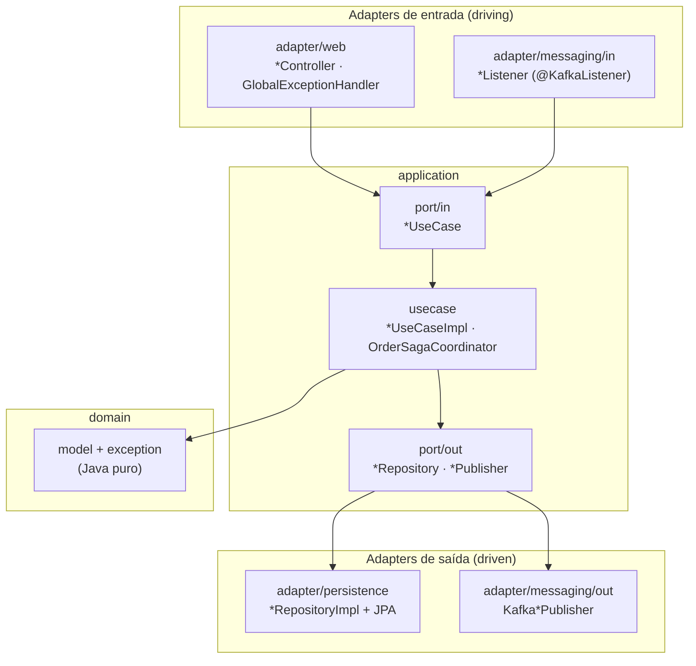
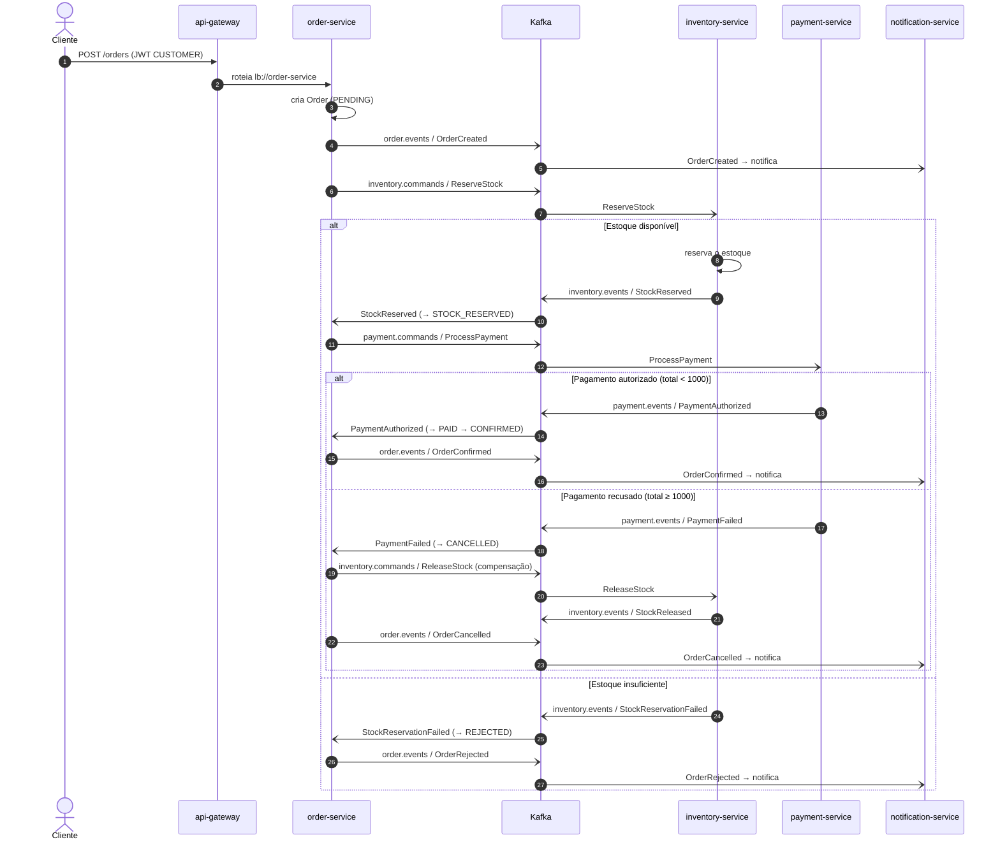
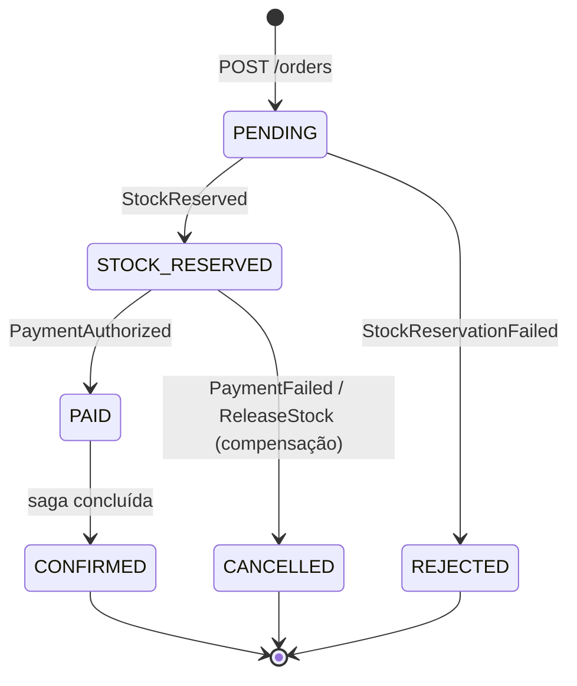
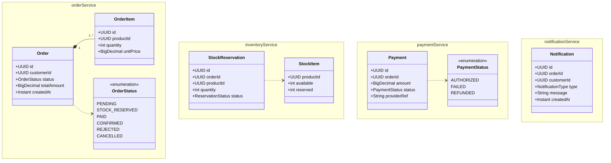

# Arquitetura

Estrutura interna, fluxo da SAGA, contratos de mensageria e modelo de domínio do ShopFlow. A visão de
componentes/deploy (serviços, Kafka, bancos, observabilidade) está no [README da raiz](../README.md#-arquitetura).

- [1. Visão geral (hexagonal)](#1-visão-geral-hexagonal)
- [2. Estrutura de pacotes](#2-estrutura-de-pacotes)
- [3. Fluxo da SAGA](#3-fluxo-da-saga)
- [4. Tópicos Kafka e contratos de evento](#4-tópicos-kafka-e-contratos-de-evento)
- [5. Idempotência e Dead Letter Topic](#5-idempotência-e-dead-letter-topic)
- [6. Modelo de domínio](#6-modelo-de-domínio)
- [7. Referências](#7-referências)

## 1. Visão geral (hexagonal)

Cada serviço de domínio adota **arquitetura hexagonal (ports & adapters)** com **layout horizontal**.
O núcleo — `domain` e `application` — não conhece HTTP, Spring, JPA nem Kafka; ele expõe **ports**
(interfaces) que os **adapters** implementam. A regra de dependência aponta sempre para dentro:
`adapter → application → domain`. Ver [ADR-0001](adr/0001-arquitetura-hexagonal-horizontal.md).



## 2. Estrutura de pacotes

Raiz por serviço: `com.wastecoder.shopflow.<service>`. Exemplo do `order-service` (o orquestrador da
saga):

```
order-service/src/main/java/com/wastecoder/shopflow/order/
├── OrderServiceApplication.java
├── domain/
│   ├── model/        Order, OrderItem, OrderStatus
│   └── exception/    DomainException, OrderNotFoundException, InvalidOrderStateException
├── application/
│   ├── port/in/      PlaceOrderUseCase, GetOrderUseCase, HandleStockReplyUseCase, HandlePaymentReplyUseCase
│   ├── port/out/     OrderRepository, OrderCommandPublisher, OrderEventPublisher, ProcessedMessageRepository
│   ├── usecase/      PlaceOrderUseCaseImpl, GetOrderUseCaseImpl, OrderSagaCoordinator
│   └── viewmodel/    PlaceOrderCommand, OrderResult
└── adapter/
    ├── web/          OrderController; handler/ (GlobalExceptionHandler, ProblemType); dto/request, dto/response
    ├── messaging/
    │   ├── in/       StockReplyListener, PaymentReplyListener, IdempotentMessageProcessor
    │   └── out/      KafkaEventPublisher, OrderCommandPublisherImpl, OrderEventPublisherImpl
    ├── persistence/  OrderRepositoryImpl, ProcessedMessageRepositoryImpl;
    │                 entity/ (OrderEntity, OrderItemEntity, ProcessedMessageEntity);
    │                 mapper/ (OrderEntityMapper); database/ (OrderJpaDatabase, ProcessedMessageJpaDatabase)
    └── config/       KafkaTopicsConfig, KafkaErrorHandlingConfig, SecurityConfig
```

`inventory-service` e `payment-service` seguem o mesmo layout (com um adapter extra cada:
`adapter/seed` no inventory e `adapter/psp` no payment). O `notification-service` é **enxuto**:
`domain/model` (sem `exception`), `application/port/in`, `adapter/messaging/in` e `adapter/persistence`
— é um consumidor (sem `messaging/out`).

### Sufixo → papel → localização

A convenção de nomes carrega o papel arquitetural:

| Sufixo / nome | Papel | Localização |
|---|---|---|
| `*UseCase` | Port de entrada (driving) | `application/port/in/` |
| `*UseCaseImpl` / `*SagaCoordinator` | Caso de uso / coordenação da saga | `application/usecase/` |
| `*Repository` / `*Publisher` | Port de saída (driven) | `application/port/out/` |
| `*Command` / `*Result` | Entrada/saída dos casos de uso | `application/viewmodel/` |
| `*Controller` | Adapter web (REST) | `adapter/web/` |
| `GlobalExceptionHandler` / `ProblemType` | Tradução de erro → HTTP (RFC 7807) | `adapter/web/handler/` |
| `*Request` / `*Response` | DTOs da camada web | `adapter/web/dto/` |
| `*Listener` | Consumidor Kafka (`@KafkaListener`) | `adapter/messaging/in/` |
| `Kafka*Publisher` / `*PublisherImpl` | Produtor Kafka | `adapter/messaging/out/` |
| `*RepositoryImpl` | Adapter de persistência | `adapter/persistence/` |
| `*Entity` / `*EntityMapper` / `*JpaDatabase` | Modelo JPA / mapper / Spring Data repo | `adapter/persistence/{entity,mapper,database}/` |
| `*Config` | Configuração | `adapter/config/` |
| `*Exception` | Exceção de domínio (HTTP-agnóstica) | `domain/exception/` |

## 3. Fluxo da SAGA

O `order-service` é o **orquestrador**: emite comandos e reage às respostas, avançando ou
**compensando** a saga. Estados do pedido:
`PENDING → STOCK_RESERVED → PAID → CONFIRMED` (e os terminais `REJECTED` / `CANCELLED`). Ver
[ADR-0002](adr/0002-saga-orquestrada.md).



### Máquina de estados do pedido



## 4. Tópicos Kafka e contratos de evento

Comunicação direta via **Spring Kafka** em modo **KRaft**. Nomes de tópicos e tipos de mensagem ficam
centralizados em constantes no adapter de mensageria (`adapter/messaging/Topics`,
`adapter/messaging/MessageType`). Ver [ADR-0003](adr/0003-kafka-spring-kafka-kraft.md).

| Tópico | Tipo | Mensagens | Chave |
|---|---|---|---|
| `inventory.commands` | command | `ReserveStock`, `ReleaseStock` | `orderId` |
| `inventory.events` | event | `StockReserved`, `StockReservationFailed`, `StockReleased` | `orderId` |
| `payment.commands` | command | `ProcessPayment`, `RefundPayment` | `orderId` |
| `payment.events` | event | `PaymentAuthorized`, `PaymentFailed`, `PaymentRefunded` | `orderId` |
| `order.events` | event | `OrderCreated`, `OrderConfirmed`, `OrderCancelled`, `OrderRejected` | `orderId` |
| `<topic>.DLT` | dead-letter | mensagens não processáveis após os retries | (espelha origem) |

**Quem produz / quem consome:**

| Serviço | Produz | Consome |
|---|---|---|
| order-service | `inventory.commands`, `payment.commands`, `order.events` | `inventory.events`, `payment.events` |
| inventory-service | `inventory.events` | `inventory.commands` |
| payment-service | `payment.events` | `payment.commands` |
| notification-service | — | `order.events` |

**Envelope** — um record `EventEnvelope` serializado em **JSON puro** (sem headers de tipo do Spring,
para manter produtor e consumidor desacoplados dos pacotes Java um do outro):

```json
{
  "eventId": "f3a1c2d4-...-uuid",
  "type": "StockReserved",
  "orderId": "9b2e7c10-...-uuid",
  "occurredAt": "2026-06-22T12:00:00Z",
  "payload": { "items": [ { "productId": "a1111111-...", "quantity": 2 } ] }
}
```

**Garantias:** produtor **idempotente** (`enable.idempotence=true`), **partição por `orderId`**
(ordenação por pedido), consumidores **idempotentes** e **DLT** por consumidor (ver §5).

## 5. Idempotência e Dead Letter Topic

O Kafka entrega *at-least-once*; o ShopFlow trata reprocessamento e mensagens venenosas. Ver
[ADR-0005](adr/0005-idempotencia-e-dlt.md).

- **Idempotência (inbox):** cada consumidor grava o `eventId` processado na tabela
  `processed_messages` (PK composta `(eventId, consumer)`) e pula duplicatas. A checagem +
  aplicação do efeito é coordenada pelo `IdempotentMessageProcessor` (`@Transactional`) no
  `adapter/messaging/in`; o identificador estável de cada consumidor vive em `adapter/messaging/Consumers`.
- **DLT:** o `KafkaErrorHandlingConfig` (`adapter/config`) registra um `DefaultErrorHandler` com
  `FixedBackOff` (3 retries, 1s) e um `DeadLetterPublishingRecoverer` que publica em `<topic>.DLT`
  (sufixo `.DLT` explícito, sobrescrevendo o default `-dlt` do Spring Kafka 4.0). Exceções
  determinísticas (ex.: `IllegalArgumentException` por payload malformado) vão **direto** para o DLT,
  sem retry. Cada serviço declara o DLT dos tópicos que consome.

## 6. Modelo de domínio

Microsserviços **não compartilham banco** (ver [ADR-0004](adr/0004-database-per-service-postgresql.md)):
relações entre serviços acontecem por **eventos**, não por referência de objeto. O diagrama mostra as
relações **internas** de cada serviço.



## 7. Referências

- [API.md](API.md) — endpoints, erros (RFC 7807) e o walkthrough do fluxo.
- [DEVELOPMENT.md](DEVELOPMENT.md) — como rodar, comandos e configuração.
- [TESTS.md](TESTS.md) — estratégia de testes.
- ADRs: [0001](adr/0001-arquitetura-hexagonal-horizontal.md) ·
  [0002](adr/0002-saga-orquestrada.md) · [0003](adr/0003-kafka-spring-kafka-kraft.md) ·
  [0004](adr/0004-database-per-service-postgresql.md) · [0005](adr/0005-idempotencia-e-dlt.md) ·
  [0006](adr/0006-problem-details-rfc7807.md).
